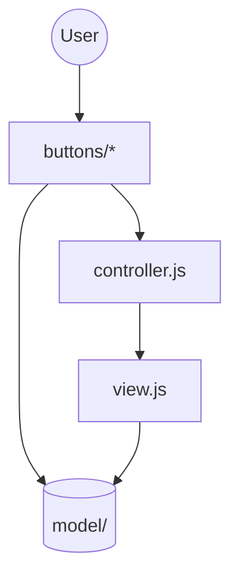
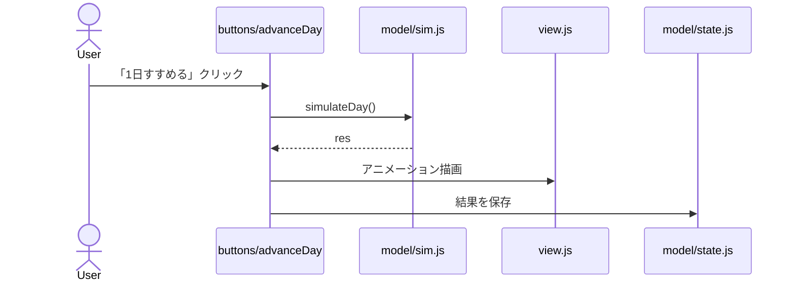

# 触れない街 (Untouchable Town)

結果は触れない。構造だけ触れる。

[遊ぶ](https://hgssnk.github.io/untouchable-town/)

## 総括

「触れない街」は、ある思想をそのまま遊べる形にしたもの。

必然的に人々が出会う街を、設計してください。

## コンセプト

- 住民は動かせない。置けるのは1日1手だけ
- 必然的環境設計の4要素が、そのまま4つのシステムになっている
  - 起こることは必ず起こる → 止められない雨
  - 観察・ログ化 → 足あととログ
  - 小さな単位での差し替え → 1日1手
  - 無意識的フロー → 触らずに回る街がクリア条件
- 評価は結果ではなく、**100日試したときの確率**

## 遊び方

- 住民5人はそれぞれの家から出て、気ままに歩く。プレイヤーは住民を直接操作できない。
- 1日に1回だけ、盤面のマスに「道」「ベンチ」「灯り」を置くか、既存のものを「撤去」できる。
- 出会いは、誰かがベンチに座っているとき、または夜に灯りの下に一緒にいるときに発生する。1日に4組以上が出会えば、その日は目標達成。
- 雨の日は外出率が下がる。雨は止められない。
- クリア条件は、7日連続で何も触らず、そのうち4日以上で目標達成すること。「最高の一手は、何もしないこと」。

## 技術の軸

- シミュレーション核を純粋関数で守る。これが全ての出口の共通資産
- 描画・音・計算・包みは、その周りに差し替え可能なレイヤーとして積む
- Web標準で作る：環境構築が軽く、書いたコードがそのまま動き、どこへでも持っていける
- **共通化より移植性**：共通化して依存関係が生まれるくらいなら、個別に何度も書く。フォルダを1個コピーしても、それ単体で成立する

## 展開の道筋

- Webで公開 → itch.ioで反応を見る → 出口を選ぶ
- 出口は3つ、核は1つ
  - Web：試す・共有する
  - スマホ(Capacitor)：生活に置く。ハプティクスで「触れる」
  - Steam(Electron)：設計を極める。シナリオ・サンドボックス・ワークショップ

## 進め方について

- 作者はコードを書く人ではなく、コードを書く構造を設計する人
- 作る過程そのものが、このゲームのプレイになっている

## リポジトリ構成

役割ごとにファイルを分割している（ビルド不要、`<script>`タグの読み込み順に依存する素朴な構成。`file://`で直接開けるようES Modulesは使っていない）。

```
./
├── README.md              このファイル
└── src/
    ├── index.html         全てはここから始まる：ページ一覧だけの入口（どのページにも依存しない）
    └── page-town/         「触れない街」ページ。フォルダ単体で完結する（今のところ唯一のページ）
        ├── index.html         実際に開くファイル
        ├── model/             Model：ドメインロジック + 永続化（sim.js, state.js）
        ├── view.js            View：描画の起点
        ├── controller.js      Controller：入力をモデル更新に繋ぐ
        ├── buttons/           操作ごとに1パッケージ。挙動と描画レイヤーを同居させる
        └── index.js           ページの起点（即時実行）
```

ファイル名はMVCに倣った：`view.js`（旧`render.js`）が実際に描く層、`controller.js`（旧`view.js`）が入力をモデル更新に繋ぐ層——名前と役割の齟齬を直した形。

`page-town/`はフォルダ単体で完結し、`src/index.html`（ページ一覧）には依存しない。ページが増えたら`page-xxx/`が並列に並び、それぞれ自分の`index.html`を持つ想定。

### 全体構造



### 「1日すすめる」の流れ

一番複雑な操作なので、MVCの各層がどう絡むかを図にする。



## 使用技術

- 素のHTML/CSS/JavaScript。ビルドツールなし。
- フォントはGoogle Fonts（Zen Kaku Gothic New）をCDN経由で読み込み。
- ダークモード（`prefers-color-scheme`）に対応したCSS変数構成。`data-theme`属性による手動テーマ切り替えを想定したCSSはあるが、切り替えUI・JSからの属性設定は未実装。

## 起動方法

`src/index.html`（ページ一覧）または直接`src/page-town/index.html`をブラウザで開くだけでも動作する（ES Modulesを使っていないので`file://`でもOK）。

開発中は`live-server`を使うと、保存するたびにブラウザが自動でリロードされて楽（キャッシュの取り違えも起きない）。プロジェクトルートで起動するので、URLは`src/`を挟む。

```
npm install
npm run dev   # http://localhost:8000/src/ を自動で監視・リロード
```

## 次の1手

- まずは公開したプロトタイプを数日遊んで、違和感を1つ見つけること
- 直すのは、その1つだけ

## 既知の課題 / 今後

- `simulateDay`は純粋関数なのでユニットテストの良い対象だが、現状テストコードはない。テストを書く段になったらVitest導入とあわせてTypeScript化を検討する。
- `window.Sim` / `window.State` / `window.createRenderer` / `window.RenderLayers` / `window.createCtx` / `window.Buttons`は、ページ単位で名前空間分けされていないグローバル。今はページ（`page-town/`）が1つしかなく、かつ各ページが自分の`index.html`から自分のscriptしか読み込まないので衝突しない（ページを跨いでスクリプトが同じ`window`を共有することがない）。ページが増えても、ページごとに独立したHTMLドキュメントである限りこのままで問題ない想定。

### Vite / Reactは見送り（検討済み）

開発中に「動かない」という症状が何度か起きたが、原因はコードのバグではなく開発用ローカルサーバーの寿命・キャッシュの問題だった（`live-server`導入で解消済み）。これを機にVite（+React）化も検討したが、見送った。

- 今回の不具合の実害は`live-server`（保存時に自動リロード、常にキャッシュを再検証）だけで解消済み。Vite/Reactを入れる動機だった問題はすでに無い。
- ゲームの対話の核はcanvas + requestAnimationFrameループで、命令型のまま。Reactを足しても、canvas部分は結局`ref`+`useEffect`で今と同じ命令型コードになる。Reactの宣言的な強みが効くのは`view.js`の`renderUI`（DOM同期、十数行）程度で、費用対効果が薄い。
- 「技術の軸」に掲げたWeb標準・ビルド不要・どこへでも持っていける、という前提が崩れる（`npm run build`が常に必要になり、`file://`直開きの選択肢が失われる）。
- プロジェクト規模（全体で500行程度）は、Viteの主な利点（コード分割・tree-shaking・npm生態系の活用）が効いてくる規模ではない。

同じ検討を繰り返さないための記録として残す。前提が変わったら（例: 複数のゲームサンプルでUIを使い回したい、リッチな画面遷移が増えるなど）再検討する。

## 数理的な見方

「必然的な設計」を、構造を選ぶことで確率を最大化する営みとして書く。

構造 $s$（配置）は結果を決めない。決めるのは、望ましいこと $A$（人々が出会う）が起きる確率だけ。

$$
p(s) = P(A \mid s)
$$

設計とは、その確率が最大になる構造を選ぶこと。

$$
s^{*} = \arg\max_{s} \, p(s)
$$

確率は1にできない。それでも正なら、繰り返すうちに必ず起こる。

$$
1 - (1 - p)^{n} \to 1
$$

最適な構造にたどり着いたら、もう触らない。「最高の一手は、何もしないこと」。

$$
s \to s^{*} \to s^{*} \to s^{*} \to \cdots
$$

このゲームでは、「100日試したときの確率」が $p(s)$ の推定値にあたる。何も置かない街では $p = 0$ で、粗い探索で見つけた配置では約 0.55 だった。


## より抽象化
### 構造優位性と、構造選択による確率最大化

結果を直接選ぶのではなく構造を選び、望ましいことが起きる確率を最大にしたら、あとは手を離す。

- **構造優位性**（思想）：結果より構造が先にある。人が触れるのは構造であり、結果は構造から確率として立ち上がる。
- **構造選択による確率最大化**（方法）：構造を選ぶことで、起きてほしいことの確率を最大にする。

**制御と設計。** 世界への働きかけ方は2つある。制御は結果そのものを選ぶ。設計は構造を選び、結果は分布として受け取る。

$$
\text{制御：} x \qquad\qquad \text{設計：} s \;\mapsto\; P(\cdot \mid s)
$$

| | 制御 | 必然的な設計 |
|---|---|---|
| 選ぶもの | 結果 | 構造 |
| 結果の現れ方 | 確定している | 分布として現れる |
| 保証の単位 | 一回ごと | 繰り返しの中で |
| 最後の一手 | 触り続ける | 触らない |

**二つの時間。** 構造は遅く変わり、出来事は速く起こる。設計者が触れるのは遅い層だけで、速い層は放っておく。1日1手という制約は、この時間の分離をルールにしたもの。

$$
\underbrace{s}_{\text{遅い・触れる}} \;\longrightarrow\; \underbrace{x_1, x_2, x_3, \dots}_{\text{速い・触れない}}
$$

**観察で閉じる輪。** 分布は直接見えない。見えるのは起きた出来事の頻度だけで、それが確率に近づいていく。

$$
\frac{\text{起きた回数}}{n} \to p(s)
$$

観察して、1手だけ差し替え、また観察する。どの1手でも $p$ が上がらなくなったところで輪は止まり、あとは触らずに回る。必然的環境設計の4要素（止められない偶然、観察、小さな差し替え、無意識的フロー）は、この輪の各段にあたる。

この枠組みはゲームに限らない。街でも場でもチームでも、「結果ではなく構造を選び、確率で評価し、最後は手を離す」という形で同じように書ける。
